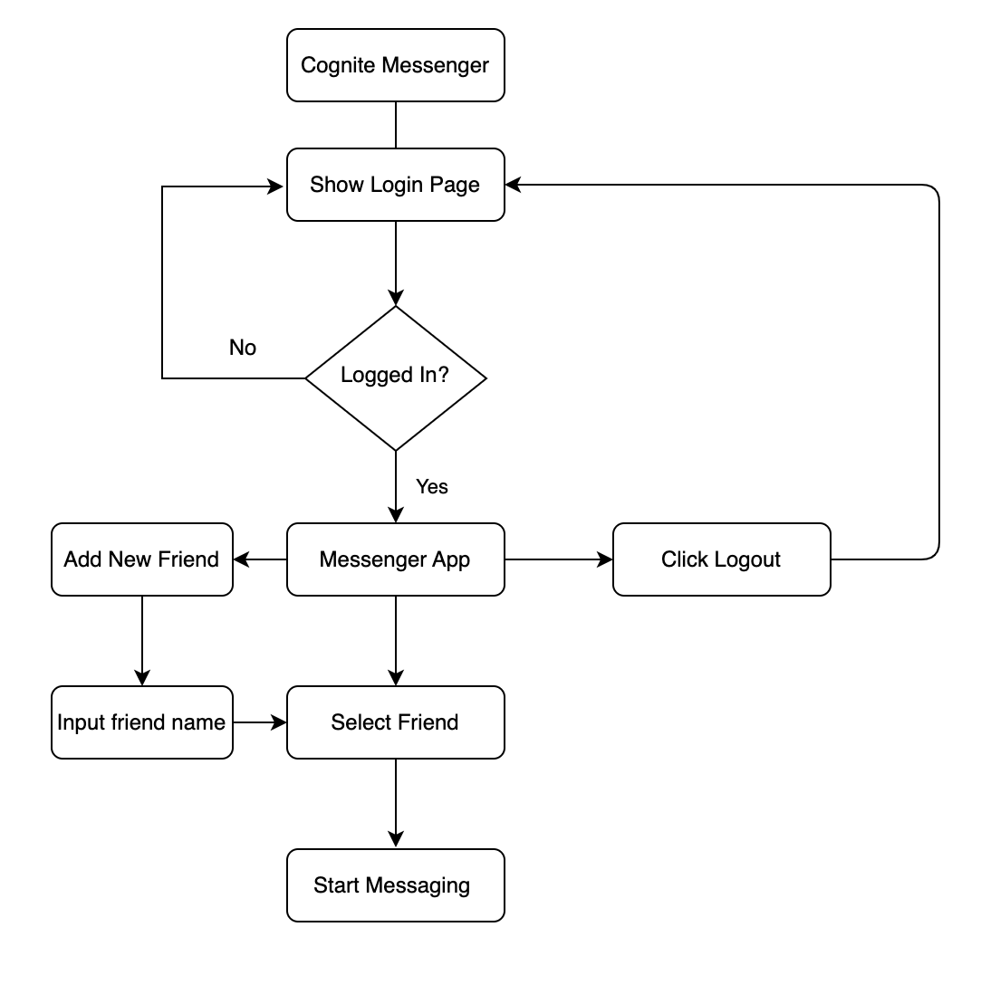

# Cognite Messenger

## Messenger App for Cognite

This messaging app is built using React, Redux Toolkit and [Vite](https://vitejs.dev/guide/).

## User-Flow Diagram

## Features

- Ability to login & logout
- Ability to add friends to chat window
- Ability to select a friend and see his/her chat with this friend.
- Ability to write messages in the chat window and see them appear.
- Ability to filter an existing list of friends
